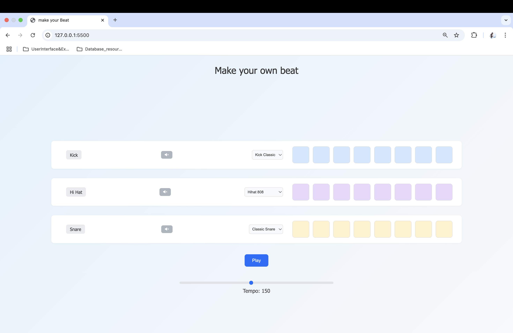

  <h1>🎵 Drumkit Sequencer</h1>
  
A clean and subtle beat-maker web app that allows users to create looped drum patterns using kick, snare, and hi-hat tracks.

  <h2>📂 Project Structure</h2>
  <ul>
    <li><code>index.html</code> – Main HTML structure</li>
    <li><code>style.css</code> – Clean UI and layout styling</li>
    <li><code>app.js</code> – JavaScript functionality and audio loop logic</li>
    <li><code>sounds/</code> – Folder containing audio files (kick, snare, hi-hat)</li>
  </ul>

  <h2>🚀 Features</h2>
  <ul>
    <li>Toggle pads to activate/deactivate drum hits</li>
    <li>Looping playback controlled by a Play/Stop button</li>
    <li>Independent tracks for Kick, Snare, and Hi-Hat</li>
    <li>Custom sound selection via dropdown</li>
    <li>Soft, modern, and minimal design</li>
  </ul>

  <h2>📸 Preview</h2>
  

  <h2>💡 How to Run</h2>
  <ol>
    <li>Clone the repository:</li>
    <pre><code>https://github.com/Kishorelin03/makeyourbeat.git</code></pre>
    <li>Open <code>index.html</code> in your browser</li>
  </ol>

  <h2>🔊 Audio Credits</h2>
  
All sound samples are open-source or self-made for educational/demo purposes.

  <h2>📄 License</h2>
  
MIT License. Free to use, modify, and distribute.

  

    ✨ Built with HTML, CSS, and JavaScript – no frameworks required.
  

</body>
</html>
